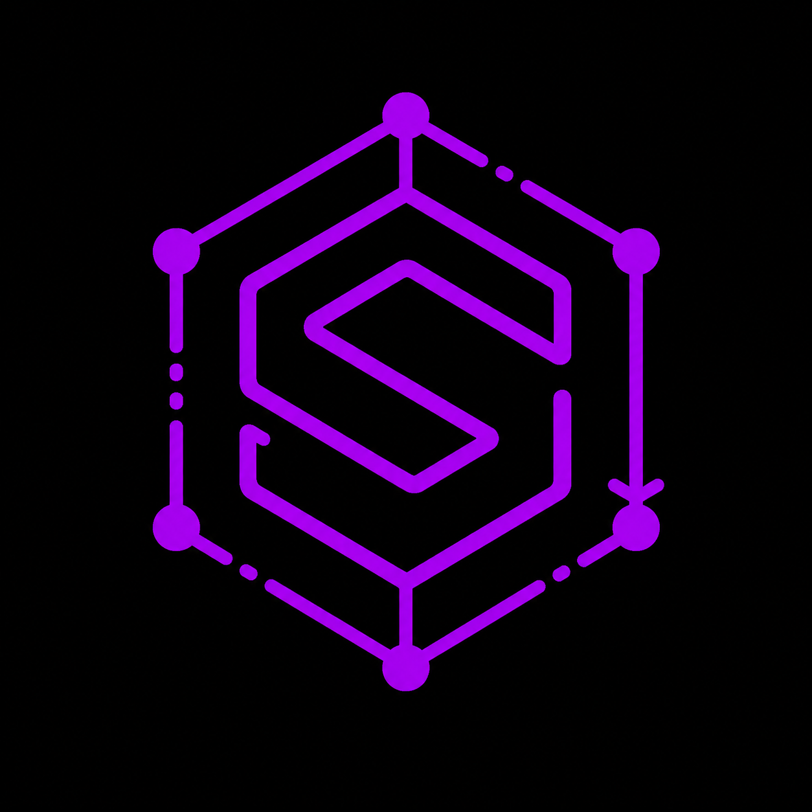

<div align="center">
  

  # SWAO -- Sovereign Workload Assessment and Onboarding

  AI-accelerated cloud workload compliance assessment with audit-grade traceability.

  [Docs](https://accenture.github.io/SWAO/en/) |
  [Website](https://steady-echo-yp4z.here.now) |
  [Discussions](https://github.com/Accenture/SWAO/discussions) |
  [Security](SECURITY.md)

  
  
</div>

---

## What is SWAO?

SWAO (Sovereign Workload Assessment and Onboarding) is an AI-accelerated compliance assessment tool
for cloud migration. It analyses source code and configuration files, evaluates them against
community compliance frameworks, and generates audit-grade HTML reports and dashboards. The CLI
runs in minutes and produces findings with full evidence traceability -- every finding cites the
exact file, line, or configuration that triggered it.

### How SWAO works

```
  +---------------+     +--------------------+     +----------------+
  |     INPUT     |     |        SWAO        |     |     OUTPUT     |
  +---------------+     +--------------------+     +----------------+
  | Source Code   |     | CLI / TUI / MCP    |     | HTML Report    |
  | Config Files  +---->| 13-pass analysis   +---->| BI Export      |
  | IaC / TF      |     |                    |     | JSON / CSV     |
  | Web Crawl     |     | GDPR    HIPAA      |     | Workload       |
  +---------------+     | AI 10 Pillars      |     | Sovereignty    |
                        | COBIT 5            |     | Profile (WSP)  |
                        | NIST SP 800-66 R2  |     +-------+--------+
                        | + your own YAML    |             |
                        +--------------------+             v
                                                  +----------------+
                                                  |  ONBOARDING    |
  <-----------------------------------------------| Terraform / LZ |
  Continuous improvement loop                     | meshStack      |
  Re-assess after each migration                  | 7R Strategies  |
                                                  +----------------+
```

---

## Key Features

- Application, Audit, and Landing Zone assessments
- Terminal UI (TUI) for interactive assessment runs
- AI-assisted finding explanations (LLM ungated -- bring your own key or use Ollama locally)
- HTML report with per-control evidence, traceability to source file and line
- Programme dashboard for multi-application views (Consultant Edition)
- MCP server for Claude Code and Cursor integration (Consultant Edition)
- 7R migration recommendations (Rehost, Replatform, Refactor, Repurchase, Retire, Retain, Relocate)
- Extensible: add custom frameworks via YAML (no TypeScript, no compilation required)

---

## Community Frameworks

Five compliance frameworks are included in all editions at no cost:

| Framework | Standard Body | Region | Controls |
|-----------|---------------|--------|----------|
| GDPR | European Parliament | EU | 47 |
| HIPAA | US Dept. of Health and Human Services | US | 45 |
| AI 10 Pillars | Accenture Responsible AI | Global | 30 |
| COBIT 5 | ISACA | Global | 37 |
| NIST SP 800-66 R2 | NIST | US | 66 |

Additional frameworks can be added via YAML configuration. See [CONTRIBUTING.md](CONTRIBUTING.md)
for the framework authoring guide. Contributions welcome via pull request.

---

## Edition Comparison

| Feature | Community | Consultant | Enterprise |
|---------|-----------|------------|------------|
| Application Assessment (AI-assisted) | Yes | Yes | Yes |
| Audit Assessment (human checklist) | Yes | Yes | Yes |
| Landing Zone Assessment (fit/gap) | Yes | Yes | Yes |
| Portfolio Assessment (100+ apps) | -- | -- | Yes |
| CLI and interactive TUI | Yes | Yes | Yes |
| LLM integration (Anthropic, Ollama, Bedrock, Vertex AI) | Yes | Yes | Yes |
| 5 Community Frameworks | Yes | Yes | Yes |
| Custom YAML frameworks | Yes | Yes | Yes |
| HTML evidence report | Yes | Yes | Yes |
| HTML portal + programme dashboard | -- | Yes | Yes |
| PDF report (branded) | -- | Yes | Yes |
| Power BI export (.pbit) | -- | Yes | Yes |
| MCP server (Claude Code, Cursor) | -- | Yes | Yes |
| Terraform + Landing Zone generation | -- | -- | Yes |
| Support | [GitHub Discussions](https://github.com/Accenture/SWAO/discussions) | Accenture PS | Accenture PS |
| Licence | Apache 2.0 | Proprietary | Proprietary |

Consultant and Enterprise editions are available for commercial engagements via Accenture
Professional Services. Reach out via [GitHub Discussions](https://github.com/Accenture/SWAO/discussions).

---

## Quick Start

Full setup guide: **[accenture.github.io/SWAO/en/getting-started](https://accenture.github.io/SWAO/en/getting-started)**

Binary downloads are coming soon. Install via npm (requires Node.js 20+):

```bash
npm install -g @swao/swao
swao init
swao assess --app my-app --framework gdpr
```

Or run with Docker:

```bash
docker run --rm -v $(pwd):/workspace ghcr.io/accenture/swao assess --app my-app --framework gdpr
```

---

## Community

We welcome framework contributions, bug reports, and feature requests.

- **Discussions:** [github.com/Accenture/SWAO/discussions](https://github.com/Accenture/SWAO/discussions) -- questions, ideas, framework sharing
- **Contributing:** [CONTRIBUTING.md](CONTRIBUTING.md) -- how to contribute frameworks, bug reports, and PRs
- **Code of Conduct:** [CODE_OF_CONDUCT.md](CODE_OF_CONDUCT.md) -- community standards
- **Security:** [SECURITY.md](SECURITY.md) -- vulnerability reporting policy (5-day response SLA)

---

## "Powered by SWAO" Badge

If your project uses SWAO for compliance assessment, you are welcome to include this badge:

```markdown
[](https://github.com/Accenture/SWAO)
```

---

## Licence

The Community Edition of SWAO is licensed under the [Apache 2.0 licence](LICENSE).
Consultant and Enterprise tiers are proprietary -- see [NOTICE.md](NOTICE.md) for edition scope details.
