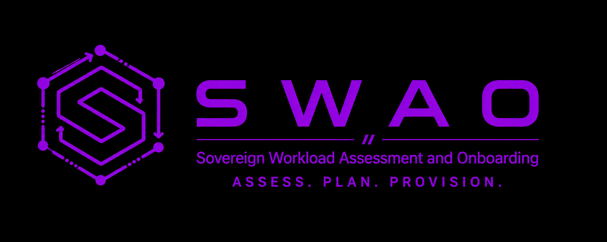

=======================================================================

                         S  W  A  O

    Sovereign Workload Assessment and Onboarding
    Sovereign Workload Assessment and Onboarding

    Community Edition  -  Apache 2.0

    Website       :  https://steady-echo-yp4z.here.now/
    Technical Docs:  https://accenture.github.io/SWAO/en/
    Source Code   :  https://github.com/Accenture/SWAO

=======================================================================
<p align="center">
  
</p>

```
//   Workloads accumulate history.
//   The cloud they were shaped for. The APIs they call at midnight.
//   The data they have promised to keep within borders.
//   The compliance posture no audit has ever measured.
//
//   Before a workload can move to sovereign ground,
//   it must be understood -- not by assumption, but by evidence.
//
//   SWAO reads eight passes deep:
//     the inventory of what runs,
//     the statefulness of what must persist,
//     the egress surface written into third-party SDK calls,
//     the cryptographic posture embedded in dependency trees,
//     the data residency commitments hiding in configuration files.
//
//   One profile. The truth about what you are running.
//   A migration plan that begins with the code, not the contract.
//
//   Assess. Plan. Provision.
//   This is how workloads become sovereign.
//
// ============================================================================
//   Helmut Schindlwick + Michael Plaschke (Accenture x meshcloud)
//   https://github.com/Accenture/SWAO
// ============================================================================
```

# SWAO -- Sovereign Workload Assessment and Onboarding

**Accenture x meshcloud** &nbsp;|&nbsp; Enterprise Cloud Migration

[](https://github.com/Accenture/SWAO/actions/workflows/ci.yml)
[](LICENSE)
[](https://github.com/Accenture/SWAO/releases/latest)
[](https://github.com/Accenture/SWAO/releases/latest)

SWAO is an AI-accelerated cloud migration assessment CLI. Given a client's source code and
operational context, it produces a **Workload Sovereignty Profile (WSP)** -- a machine-readable
YAML artefact covering cloud readiness, compliance posture, security findings, and a migration
plan -- then hands off to meshStack for automated tenant provisioning.

---

## What it does

```
# Workspace + assessment
swao init --name my-app     # scaffold a new assessment workspace
swao assess --app my-app    # run multi-pass analysis, emit WSP under wsp/runs/<ts>/
swao report --app my-app    # render auditor / business / WSP-summary reports
swao generate-tf --app X    # emit Terraform HCL for the target landing zone
swao health-check                 # 10-probe pre-flight (licence, Playwright, MCP,
                            # compliance catalogues, imports, traceability,
                            # BI export, scope, prerequisites, vcs-auth)

# Observability + feedback
swao log tail               # stream the WSP-scoped event log (warn+ default)
swao log export --for-feedback --out feedback.tar.gz
                            # PII-redacted bundle ready to email back

# Compliance frameworks
swao framework list         # enumerate bundled + installed community frameworks
swao framework install <id> # copy bundled framework into the workspace
swao framework info <id>    # print classification, contributor, applicability

# LLM provider configuration
swao credential set anthropic-api-key sk-ant-...
swao credential set openai-api-key sk-...
SWAO_LLM_PROVIDER=anthropic|openai|ollama|stub  # rotate at run time
```

Static + dynamic analysis passes -- Inventory (Pass 01), Statefulness (02),
Data Classification (03), Context Ingestion (04), SBOM CVE (05), 12-Factor (06),
Egress (07), Cryptography Posture (08), Synthesis (09), Dynamic Analysis /
Playwright crawl (10), Compliance Evaluation (11), Block Assessments (12),
Scope Coverage (13) -- produce namespaced signals (`INV-01`, `EGR-03`,
`CRYPTO-07`, ...) that feed the WSP. The Context Ingestion Layer reads
consultant-supplied context files (`imports/`) and records any contradictions
with source-code evidence. Dynamic analysis is opt-in via `--passes dynamic`
or runs by default in full sweeps (skip with `--no-crawl`).

**LLM providers:** Anthropic (default, recommended per ADR-0034), OpenAI
(`gpt-4o-mini` default; `gpt-5-mini` / `gpt-5` configurable), Ollama
(air-gapped, local models), stub (CI / offline).

**Compliance frameworks:** 11 community frameworks ship bundled and free (GDPR,
AI 10 Pillars, BSI C5, BSI IT-Grundschutz 2023, HIPAA / NIST SP 800-66r2, LLM
Selection, NCA CCC 2024 CSP, NCA CCC 2024 CST, NCA ECC 2024, PCI-DSS v4, SAMA
CSF v1). Install into a workspace via `swao framework install <id>`.

> **Operator references**
> - **CLI command reference:** [`docs/runbooks/cli-reference.md`](docs/runbooks/cli-reference.md)
>   -- when to reach for each subcommand and how they chain across an engagement.
> - **Batch samples:** [`ops/batch-samples/`](ops/batch-samples/) -- ready-to-edit Windows
>   `.cmd` and POSIX `.sh` scripts for "assess N apps + emit portfolio BI bundle" in one run.
> - **In-binary help:** `swao --help`, `swao <subcommand> --help` -- auto-generated and
>   always the source of truth for flag details.

---

## Repository layout

```
swao/
├── packages/
│   ├── swao/          # CLI binary (Commander.js, TypeScript strict)
│   └── providers/     # Pluggable provider drivers
├── examples/
│   └── publications/          # Sample HTML assessment publications
├── docs/
│   └── runbooks/      # Setup guides
├── controls/          # Compliance control catalogue
└── landing-page/      # Marketing landing page (standalone HTML)
```

---

## Quick start

```bash
# 1. Scaffold a new workspace (creates apps/, wsp/, .swao.yml)
swao init my-workspace

# 2. Verify prerequisites (licence, credentials, catalogues, BI templates)
swao health-check

# 3. Add an LLM API key (Anthropic recommended; or use OpenAI / Ollama)
swao credential set anthropic-api-key sk-ant-...

# 4. Run a full assessment against your application
swao assess --app my-app

# 5. Render reports (auditor, business value, WSP summary)
swao report --app my-app
```

Static passes complete in ~30 seconds; LLM passes (synthesis, compliance evaluation,
block assessments) take 3-8 minutes depending on codebase size and LLM provider latency.
The `swao assess` TUI shows per-pass progress and a live output window.

---

## Interfaces

### CLI

The primary interface for scripted + batch assessments. Every capability is reachable
via `swao <subcommand> [flags]`. Use `swao --help` or `swao <subcommand> --help` for
flag details.

Key subcommands: `init`, `assess`, `report`, `doctor`, `framework`, `credential`,
`log`, `generate-tf`, `export`, `mcp`.

Reference: [`docs/runbooks/cli-reference.md`](docs/runbooks/cli-reference.md)

### TUI

The interactive terminal UI guides operators through assessment setup: choose an app,
select passes to run, toggle the LLM provider, monitor live output, and launch the BI
export bundle -- all from a single keyboard-driven session. Launch with `swao assess`
(no flags) and navigate with arrow keys + Enter.

Key screens: Assessment Type picker, App selector, Pass selector, Live output (bounded
viewport, Ctrl+G for guidance), BI export panel with hot-keys for PowerBI Desktop.

### MCP

SWAO exposes an MCP server that Claude Desktop and Claude Code connect to over
`http://localhost:3737`. Start it with `swao mcp --http` then point your Claude client
at the local endpoint. The server exposes tools for assessment orchestration, signal
inspection, and report generation -- enabling conversational "run the assessment on my
app and tell me what the sovereign risk factors are" workflows.

Architecture: ADR-0045 (`docs/adr/0045-mcp-dual-transport-http-localhost-for-claude-code.md`)

### PowerBI

SWAO ships `.pbit` template files for four report surfaces:

- **App Report** -- per-application sovereignty profile, migration recommendation, compliance
  heatmap, egress map, and risk scores.
- **Portfolio Overview** -- multi-app roll-up view for programme leads and client executives.
- **Auditor View** -- control-level evidence table and gap analysis for auditor sign-off.
- **Compliance Matrix** -- cross-framework overlap view (GDPR / HIPAA / PCI DSS / ISO 27001 / ...).

After `swao assess` completes, run `swao export` (or press Enter in the TUI) to emit the
CSV + NDJSON + XLSX bundle, then open the template and point `SWAOExportPath` at the bundle
directory.

Authoring guide: available to licensed Consultant and Enterprise users on request.

---

## Getting started

**Prerequisites:** Node.js 20+ LTS, pnpm 10+

```bash
git clone https://github.com/Accenture/SWAO.git
cd SWAO/swao
pnpm install          # install workspace dependencies
pnpm build            # compile TypeScript
pnpm test             # run test suite
node dist/swao.js --help
```

### Docker quick-start

```bash
# Build the image (from repo root)
bash scripts/build-image.sh

# Run an assessment -- mount your portfolio directory at /workspace
docker run --rm \
  -v "$(pwd)/my-portfolio":/workspace \
  -e SWAO_CREDENTIAL_ANTHROPIC_API_KEY="sk-ant-..." \
  accenture/swao:dev assess --app my-app

# Other commands work the same way
docker run --rm accenture/swao:dev --help
docker run --rm accenture/swao:dev --version
docker run --rm -v "$(pwd)/my-portfolio":/workspace accenture/swao:dev doctor
```

The image is built from a multi-stage Dockerfile: TypeScript is compiled in a build
stage, then only production dependencies and compiled output are included in the runtime
image. Playwright browser binaries are excluded to keep the image lean (target: under 400 MB).

Inspect the image size after `scripts/build-image.sh` completes:

```bash
docker images accenture/swao:dev --format "{{.Repository}}:{{.Tag}} {{.Size}}"
```

The published ghcr.io multi-arch image (`ghcr.io/accenture/swao:latest`) is
cross-compiled for `linux/amd64` and `linux/arm64`; pull either via
`docker pull ghcr.io/accenture/swao:latest` and inspect with `docker inspect`.

---

## Project status (as of v0.11.2, 2026-08-24 / preparing v1.0.0)

| Milestone | Description | Status |
|---|---|---|
| M0 | ADR ratification + pre-engineering foundation | Closed |
| M1-M11 | WSP schema, CLI, static passes, dynamic crawl, compliance engine, doctor probes, full report, Terraform generator, UniPipe E2E, Docker packaging | Closed |
| M15 | Security Hardening | Closed |
| M16 | BI Templates + Auditor UX | Closed |
| M17 | Assessment Scope Transparency (Pass 13, blind-spots catalogue) | Closed |
| M18 | Licensing Hardening (Ed25519 offline-verified keys) | Closed |
| **M19** | **Provider Hardening + Observability + Feedback Loop** (OpenAI driver, WSP-scoped event log, vcs-auth probe, PII-redacted feedback export) | **Closed in v0.1.3** |
| **M24** | **HTML Publication Engine** (Mode A single HTML, Mode B static site, Publication Editor, Live Portal, global search, mobile responsive, i18n DE) | **Closed in v0.2.2** |
| M24 HTML Quality | HTML Publication Quality UAT (navigation, Mode B sync, search, dark mode, hamburger) | Closed in v0.2.3 |
| **M26** | **Assessment Reliability: contamination paths closed, StubLlmProvider deleted, provenance output, data quality banner, swao diff/accept, signal provenance, live LZR adapters** | **Closed in v0.2.5** |
| **M27** | **HTML Publication Quality + Distribution Security** (compliance overlap matrix, controls section, delta view, cassette CI, Playwright strip, VirusTotal gate) | **Closed in v0.3.0** |
| v0.3.1 patch | Security scanner false positive fix: split GCP service-account regex in redact-pre-llm.ts; .trivyignore added | Closed in v0.3.1 |
| **v0.3.2** | **TUI Consistency + HTML Single Page + Stabilisation (sprint-055)**: L0 Assessment Type screen, multi-language source detection, Ctrl+G guidance collapse, HTML Editor area model, compliance tile click fix, LLM cache off by default, Rust/Go/Python language detection | **Closed in v0.3.2** |
| **M0042** | **Modular Architecture** (sprints 057-066): @swao/core + host-injected @swao/module-* packages, community/consultant/enterprise tiers with runtime requireTier gating + per-tier builds | **Released in v0.4.0; hardened through v0.4.2** |
| **v0.4.3** | **Offline licence management** (sprint 067, #0612): operator issuance registry (`swao-premium`) + `swao license issue --json`, `swao health-check` expiry warning, operator licence-management console, slimmed in-product licensing UI to fingerprint/request/activate | **Closed in v0.4.3** |
| **Sprint 068** | **Go-Live Polish** (2026-06-27): all assessment types (app/audit/landing-zone/llm/hybrid) reachable from TUI; branch protection active on main; automated OSS security gate in release.yml; community-health files header-standardised; workspace scaffold files carry SWAO branding; git clone progress flood suppressed; binary renamed to `swao-win-x64.exe`; GDPR default on `swao init` | **Closed (no version bump; v0.4.3 stays)** |
| **v0.4.4** | **OSS Distribution Hardening + Compliance Publication fixes** (sprint 069, M20): not-assessed controls published with rationale; compliance filter chips for all frameworks; cross-regime coverage matrix control IDs clickable; TUI audit/landing-zone enabled (not coming-soon); SWAO ASCII headers on dist-bin artefacts; glossary binary path fix; MCP parity audit (#0643 filed) | **Closed in v0.4.4** |
| **v0.4.5** | **Compliance framework detail block** (sprint 070, #0648): new `compliance-framework-detail` HTML publication block with full hierarchy (framework, requirements, signals, evidence links); editor template slot sync fix (6 blocks were silently dropped from Block Manager preview) | **Released 2026-06-27** |
| **v0.4.6** | **Signal navigation + PowerBI path UX** (sprint 070): compliance-framework-detail signal links now navigate directly to each signal with per-signal pills + highlight-all for multi-signal controls (#0651); PowerBI templates use single `SWAOWorkspaceRoot` parameter -- `SWAOExportPath` and `EvidenceUrlPrefix` auto-derive (#0653); HTML Editor template exports to `wsp/templates/html/`; TUI first-time setup guidance for new workspaces | **Released 2026-06-28** |
| **v0.4.7** | **LZ assessment UX + workspace catalogue override** (sprint 070): provider and region inputs converted from free-text to SelectInput driven by the bundled catalogue; failure label corrected for setup errors; Consultant/Enterprise operators may place a custom `lz-catalogues/` folder at workspace root to override bundled providers/regions (sovereign clouds, private providers); `gateLzCatalogueOverride()` gate in LicenseGuard | **Released 2026-06-28** |
| **v0.4.8** | **Sprint 070 close -- TUI polish + security hardening**: TUI assess-done screen correct for LZ (100% progress, lz_fit pass, verdict); Cargo.toml service_dep extraction for Rust projects; AssessmentTypeScreen header compact (hideLicenseStatus, duplicate affordance removed); AssessScreen App/passes/LLM info line removed (wraps badly); output cap always 5 lines during running assessment; xlsx replaced by exceljs in swao-premium (CVE-2023-30533 + CVE-2024-22363 closed) | **Released 2026-06-28** |
| **v0.4.9** | **Sprint 073 -- public release prep + Pass 14 MALWARE Phase 1**: go-live dry-run all 6 gates pass; Pass 14 malware detection implementation (15 tests, Windows PE + script heuristics); community framework contributor attribution uses GitHub link (email removed from public OSS files); SEA build script async fix; PowerBI coverage verified (0685); binary E2E timeout corrected for first-run AV scan | **Released 2026-06-30** |
| **v0.5.0** | **Sprint 074 -- OSS Gate + Architecture Publication + Bug Fixes + MALWARE Phase 2**: Pass 14 MALWARE Phases 2+3 (ClamAV + YARA + ORT feature flag); SEA binary VirusTotal baseline; architecture publication updated to v0.4.9 (10 frameworks, 22 MCP tools, tier model, WSP v0.11) + legal intake questionnaire; TUI phantom regimes bug fixed (selected framework only runs); source validation guard in `swao assess` (empty-dir exit); health-check source accessibility probe; setup wizard git URL as primary input with inline validation | **Released 2026-07-01** |
| **v0.5.1** | **Sprint 075 -- Test Foundation + OSS Release Prep + UX Batch 2/3**: MCP HTTP smoke test (#0670 Ph2), CLI + pass smoke tests (#0670 Ph1), TXT report formatting consistency (#0697), three-tier release workflow symmetry (#0678), pass selector improvements (#0692-#0694), assessment-type scope filter (#0696), LLM_SELECTION rename (#0695), cross-regime matrix chip tooltips (#0698), LZ label fix (#0700), global chip tooltip + signal navigation (#0701), evidence gallery file links (#0702), inline signal linkifier (#0703), licence screen compact (#0707), OS-default browser on publish (#0699), health-check label fix in TUI (#0690) | **Released 2026-07-01** |
| **v0.5.6** | **Sprint 076 QA patch -- TUI + PDF + license redesign**: TUI bleedthrough fixes (#0712 #0713 #0742); assessment log viewer L key (#0715); PKG binary shell-open fix (#0726 #0733); PDF column layout fix (#0727 #0728); HTML evidence links new-tab (#0730); Main Menu TF Modules disabled (#0736); GuidanceBox width + what-preview (#0737 #0741); startup banner version+tier (#0738); CredentialScreen guidance (#0740); license activate error clarity (#0743); license token redesign with user fields + guided request form (#0744); license-tui + issue-license validation fixes (#0745); Design 066 demo-community-frameworks spec | **Released 2026-07-03** |
| **v0.5.7** | **Sprint-076 continuation**: compliance multi-regime fix (#0748), LicenseScreen UX cleanup, CMDB naming convention, TUI regression tests (39 tests, all 5 screens covered), hardcoded YAML field path audit (#0751) | **Released 2026-07-03** |
| **v0.5.8** | **Sprint-076/077 QA batch**: GuidanceBox Escape conflict fixed (#0760), app list filter for large workspaces (#0763 #0762), regimes field path fix (#0755), LZ Catalog Assessment rename (#0764), crash handler + NDJSON crash log (#0766), HealthCheck engagement info (#0756), GuidanceBox in Help/HealthCheck/Serve screens (#0759), LZ Catalog sync stub (#0765). Closes 18 QA issues. | **Released 2026-07-04** |
| **v0.5.9** | **Sprint-076 close**: PDF structured renderer (#0710), VitePress runbooks 13 EN + 13 DE (#0679), binary E2E all commands + TUI component tests 10 screens + coverage gate (#0670), type-to-filter helper (#0796), demo framework semver fix (#0797), Playwright URL phase (#0776-C), multi-assessment strategy ADRs 0051/0052. | **Released 2026-07-04** |
| **v0.5.10** | **Sprint-076 final batch**: optional LZ target step in app assessment TUI + inline catalogue fit (#0732); landing_zone schema separation (primary=null, status=slug); engagement hub block profile + workspace aggregation (#0794 #0795); engagement metadata + assessor pre-fill in SetupWizard (#0722 #0723); community catalog probe in doctor (#0724); PDF color coding + compliance table (#0729); Anthropic retry hardening (#0716); risk register fields (#0731); block profile CLI/MCP parity gate (#0793); landing-zone-catalog router token rename (#0781). | **Released 2026-07-04** |
| **v0.5.11** | **Sprint-078 M30 multi-type run resolver fix**: `resolveSourceWspRun` prefers `latest-application.txt` over `latest.txt` so LZ catalog runs do not shadow application data for BI export and portfolio (#0786); ExportBiScreen + PortfolioScreen backward-compat eligibility; RunContextPicker utilities exported + 13 new unit tests; MCP tool-set pin updated (swao_hub + block_profile); 3 resolver regression tests. | **Released 2026-07-04** |
| **v0.5.12** | **Sprint-078/079 QA crash batch + per-app credential hub**: per-app VCS + Playwright credential hub in assessment flow (#0814); GuidanceBox Ctrl+G systemic wiring across all 22 screens (#0798 #0810 #0813); MainMenu stale-closure crash fix (#0816); PDF report layout fixes (#0817); HTML publication signal tooltips + evidence links (#0818 #0819); HTML editor sidebar nav (#0820); Power BI Demo framework compliance controls populated via derivation parse (#0823); partnership_lead excluded from wsp.yaml scrub (#0824); launcher writes ASCII banner before PKG binary starts (#0808 #0812). | **Released 2026-07-06** |
| **v0.5.13** | **Sprint-079 TUI per-app wizard + E2E tests + Power BI fixes**: per-app LLM override (L key) + pass-profile persistence + edit-only mode without starting assessment (#0800); CLI assess E2E `run-manifest.json` assertion (#0807-P2); MCP assess E2E via HTTP streamable transport -- Layer 6 coverage (#0807-P3); star-schema exporter now reads `assessment.regimes` from pass files so demo frameworks export 47 real controls (was 0) (#0823 re-fix); Power BI decimal locale fix -- `TransformColumnTypes("en-US")` (#0821); Scope Coverage Ratio DAX corrected to `DIVIDE(closed+partial, total, 0)` (#0822); `display_name` + `description` added to SwaoYmlAssessmentSchema. | **Released 2026-07-06** |
| **v0.5.14** | **Sprint-080 QA batch + evidence portability**: safeReadYaml audit (#0826); demo-framework 47-control fixture test (#0827); design doc 069 evaluator output locations (#0828); `--evidence-base-url` flag + `input-evidence-url` TUI phase (#0836); Playwright detection warning (#0833); LZ verdict lowercase fix (#0834); LZ region auto-advance removed (#0832); coverage bar segments clickable (#0838); top-findings severity sort (#0837); credential screen key remap (#0831); Windows launcher docs (#0830); regimes_active in sovereign-health .swao.yml (#0835). | **Released 2026-07-07** |
| **v0.5.15** | **Sprint-081 QA fix batch (21 issues)**: SetupWizard catalog cleanup (#0840); COBIT-5-demo removed from init scaffold (#0842); GuidanceBox auto-open (#0845); challenge .swao.yml LLM config (#0847); LensesScreen MultiSelect (#0849); ChallengeScreen multi-agent (#0852 #0854); AssessScreen LLM config (#0855); swao.bat ASCII header (#0858 #0839); scaffold version from package.json (#0841); LZ single-region auto-advance (#0848); evidence URL input fix (#0850); GuidanceBox white text (#0853); stats table "Items" column (#0846); challenge output in PDF (#0851); binary host playwright loader (#0859). | **Released 2026-07-07** |
| **v0.5.16** | **Sprint-082 QA bug fix batch (9 issues #0860-#0868)**: sprint-close.sh staging fix; SelectInput JSDoc; lzVerdict lowercase design-doc note; STACKIT capitalisation (8 files); challenge multi-select in binary; challenge unhandled async -> exit 1; CredentialScreen GuidanceBox on set-value/list; HelpScreen GuidanceBox top + wrap; PDF trailing empty page (pdfkit width guard). BSI IT-Grundschutz 2023 added as 11th bundled community framework. | **Released 2026-07-07** |
| **v0.5.17** | **Sprint-082 LZ catalogue adapter batch (4 issues #0869-#0872)**: Azure Retail Prices API adapter (anonymous, 76-entry SERVICE_FULFILLS, 55-region sovereignty overlay) (#0869); GCP region-picker products.json adapter (#0870); STACKIT PIM API adapter (#0871); TUI LZ Catalogue Update screen (#0872). `mergeRetiredServices()` preserves retired services with stable `retired_at` dates. `swao lz catalogue update --provider all` now covers 6 partitions: aws, aws-esc, aws-iso-e, stackit, gcp, azure. | **Released 2026-07-07** |
| **v0.6.0** | **Sprint-083 BSI Frameworks + E2E Test Suite Foundation (18 issues #0873-#0879)**: BSI IT-Grundschutz 2023 v0.2.0 expanded to 105 controls (72 Basis + 33 Standard) (#0873 #0874); BSI C5:2020 v1.0.0 expanded to 62 controls across all 17 domains (#0875); E2E test suite foundation -- 5 Playwright journey specs, 26 TUI ink tests, golden star-schema fixture, CI e2e job (#0525-#0530); Azure live catalogue transport + OneDrive/Graph adapter (#0688); ExportBiScreen UX Step 1/2 (#0734 #0735); YAML round-trips + G2 inline login (#0751 #0776); `swao report --format html` (#0877); `pass_profile`/`lenses` enforcement (#0878); Pass 14 malware scan usability -- doctor probes, config wiring, `--malware-fail-on-detection`, security-focus lens, user guide (#0879). | **Released 2026-07-08** |
| **v0.7.0** | **Sprint-084 QA Fix Batch + Sprint-085 LZ Catalogue Fixes (28 issues #0880-#0907)**: Playwright crawl login automation (#0893 #0896); crawl static-asset link filter (#0892); sitemap.xml pre-seeding (#0894); LZ multi-CSP multi-region selection (#0899); LZ catalogue update missing from Enterprise binary (#0898); LZ AVAILABLE_NOT_ENABLED verdict tier (#0897); pass profile pre-flight validation (#0890); default passes exclude Playwright + Malware (#0901); challenge pre-flight LLM check (#0902); help screen pagination (#0903); GuidanceBox focus fix (#0884); credential URL-match offer (#0885); Pass 14 malware block auto-write (#0886); Playwright detection re-evaluation on re-entry (#0887); `lz catalogue update` ENOENT-in-pkg fix -- writes to `wsp/inputs/catalogs/lz-catalogues/` (#0905); Azure 429 retry-with-backoff (#0906); `lz catalogue list/show` workspace-aware resolution (#0907); challenge structural validation (#0904). | **Released 2026-07-09** |
| **v0.7.1** | **Sprint-087 QA fix batch (18 issues #0908-#0925)**: ChallengeScreen polish -- header, guidance box, progress bar, width-aware agent list (#0915-#0918); challenge canonical YAML envelope + HTML publication block + log events (#0919-#0921); LzCatalogueUpdateScreen progress bar + output (#0912 #0913); LZ `index.json generated_at` preservation (#0914); LZ sovereignty gate `regimes_active` fallback (#0924); LZ multi-target display (#0923); AssessScreen Playwright hub credential reuse + assess.log LZ path (#0908 #0909); lzr_input_type catalogue tracking + RunContext audit fields (#0910 #0911); LensesScreen pass union box width (#0922); current-infra label (#0925). | **Released 2026-07-10** |
| **v0.7.2** | **Sprint-088 M31 Phase 1 (13 issues #0926-#0938)**: NIST_SP_800_66R2_DEMO rename (#0926); Playwright machine-level package detection (#0927); assess-done block summary + Stakeholder Challenge shortcut (#0928); publication V8 crash fix -- 50-control cap + old-format challenge YAML (#0929); D1 ci.yaml token store (#0930); D2 single BUNDLED_TEMPLATE (#0931); D3 content write-back (#0932); E1-E5 error handling + T1-T7 test coverage (#0933-#0938). | **Released 2026-07-10** |
| **v0.7.3** | **Sprint-088 M31 Phase 2 -- HTML Publication Component Library (Steps 0-11, 19 commits)**: three-tier CSS token hierarchy + §1-§7 CSS structure (#0939/#0940); D4 Phase 2 HTML Editor branding panel + colour picker + theme presets (#0942); profile YAML workspace override layer + 6 base profiles (#0943); Component Library registry -- Zod OptionSchemas for 5 components (#0944); profile variant system + `--profile-variant` flag (#0945); `renderComplianceTileGrid`, `renderChartDonut`, `renderChartSeverityBar`, `swaoTooltip`, `swaoRagBadge`, `swaoProgressBar` extracted (Steps 2-6, #0946-#0950); configurable top nav from `profile.nav.top` (Step 7, #0951); `blocks.ts` split into 7 domain files (Step 9, #0953). 164 tests passing. | **Released 2026-07-11** |
| **v0.7.4** | **Sprint-088 Ingestion Layer -- Pass 00 rewrite (6 issues #0962-#0967)**: content-based routing via classifier; SHA-256 delta detection; cleanup of removed sources; binary text extraction (PDF/DOCX/XLSX/PPTX); unmanaged file warnings; scaffold simplified to cmdb stub only; `swao ingest` CLI command + IngestScreen TUI (Tools submenu key 7). | **Released 2026-07-11** |
| **v0.7.5** | **Sprint-088 M31 close-out (#0968-#0989)**: HTML publication Phase 2 batch (exec summary 6 findings + narrative, engagement hub card-grid, methodology LZ verdict guide + 7R table, DEMO framework label); lens/challenge wizard integration (Design 074 Steps 3+8 -- `input-lenses` + `challenge-prompt` phases, provenance `lenses_used`); ingestion health probe (ok/warn/info/absent) + SetupWizard hint; gitignore scaffold binary+logs merge path; Power BI DAX worst-child aggregation fix (Category Coverage measure). | **Released 2026-07-11** |
| **v0.7.6** | **Sprint-089 QA fix batch (19 issues #0991-#1011)**: lenses guidance panel + pass filtering; LZ region country filter; health-check ingestion probe text output (12th probe); rejected-file delta detection in IngestManifest; Playwright skipped-pass summary in assess-done; PDF unconditional addPage + severity label alignment; HTML publication multi-iteration pass stats; `swao publish --template` flag; LZ all-blocked aggregate warning; BSI C5 `require_certifications` sovereignty gate. | **Released 2026-07-11** |
| **v0.7.14** | **Sprint-098 HTML Editor + Publication Phase 3A (11 issues #1121-#1131)**: HTML Editor button non-response root-cause fix (JS escape in template literal); assessment type selector (application/lz-catalog); `BLOCK_PROFILES` static registry; `LZ_CATALOG_TEMPLATE` per-type template; profile-specific template slot list in `/context`; engagement hub full publication chrome (classification band, site-header, sidebar, breadcrumb); Playwright E2E harness with outcome assertions (YAML written, srcdoc populated, file exported, block list profile switch). | **Released 2026-07-17** |
| **v0.7.13** | **Sprint-097 Playwright Crawl QA + LZ Report v2 (21 issues #1100-#1120)**: per-stakeholder LZ PDFs (one per LZCA agent); CSP/Region comparison table in each LZ PDF; Anthropic short-response overload detection + unit tests; dropdown nav discovery via `discoverDropdownNavUrls`; PDF font consistency (all columns Helvetica); signal ID hyphen-wrap fix; reports-app rename; AA_ prefix for app challenge files; LZCA schema fixes (severity, opening_statement, assessment_mode); LZ fit BSI_C5 token alias fix; DATA pass truncation recovery. | **Released 2026-07-17** |
| **v0.8.1** | **Sprint-101 TUI QA + CLI Bug Fixes (#1145-#1152)**: Health check wizard hang fixed (PKG_EXECPATH cleared in spawn); GuidanceBox stale-frame padding; `swao challenge --all-agents` implies `--report`; `swao assess --model` flag added; Azure LZ catalogue `regions_count` corrected (18 -> 16). | **Released 2026-07-19** |
| **v0.8.0** | **Sprint-100 Saudi Arabia Regulatory Frameworks (#1133-#1144)**: NCA ECC-2:2024 (28 ctrl), NCA ECC Demo (20 ctrl), NCA CCC-2:2024 CST (18 ctrl), NCA CCC-2:2024 CSP (37 ctrl), SAMA CSF v1.0 (30 ctrl, maturity model). WSP plan schema additive: `cst_class_required` + `maturity_assessment`. DATA pass Saudi tier emission. 27 new tests. | **Released 2026-07-18** |
| **v0.7.18** | **Sprint-099 HTML Editor layout fix + dark mode accessibility**: Binary rebuild includes all HTML editor changes; 30+ dark mode CSS token overrides for WCAG AA. | **Released 2026-07-18** |
| **v0.7.12** | **Sprint-096 Application Assessment Debug (#1096-#1099)**: Pass 03/04 JSON garbage-prefix recovery, LLM max_tokens configurable via .swao.yml, progress bar in-flight indicator during LLM pass, (opt-in) label removal, error box overflow fix. | **Released 2026-07-15** |
| **v0.7.11** | **Sprint-093 QoL batch part 2 (#1080-#1091)**: Playwright authenticated crawl (vault URL injection, HTTP Basic Auth, CSR login timing), MultiSelect Ink rendering fix, Anthropic 120s timeout + retry log error detail. | Released 2026-07-14 |
| **v0.7.10** | Sprint-093 QoL batch part 1 (#1078-#1079): Pass 14 malware tool-skip diagnostics; install-playwright post-install verification with npm prefix diagnostic. | Released 2026-07-14 |
| **v0.7.9** | Sprint-092 bugfix batch (#1071-#1077) -- lens auto-framework + pass pre-selection, new-app state reset, Playwright probe/assess consistency. | **Released 2026-07-14** |
| **v0.7.8** | Sprint-091 QA fix batch (23 issues #1041-#1070) -- runbook anchor Zod fix, display-name wizard, scaffold publication/run_retention blocks, image-to-PDF ingest, synthesis pass-dir race, duplicate-pass dedup. | **Released 2026-07-12** |
| **v0.7.7** | **Sprint-090 HTML Editor pipeline + Publication Quality (28 issues #1013-#1040)**: HTML Editor nav.top/nav.side format sync (#1028 #1029); content settings path + YAML key fix (#1030); colour token alignment (#1031); block order from profile applied to render sequence (#1032); all publication blocks configurable (#1033 #1034); remediation runbook generation (#1035); framework tile compact grid (#1036); assessment passes detail text (#1037); executive summary redesign (#1038); pass-profile deduplication (#1039) and LZR/MAL alias recognition (#1040); latest.txt written only at run completion (#1023); LZ region selector uppercase/dash/truncation fix (#1021); challenge run signal-ID consistency (#1022); `swao init` scaffold key deduplication (#1018); DEMO lens auto-select (#1019); ingestion folder TUI tip (#1020); publication run-history links (#1013 #1014 #1015); run retention `workspace.run_retention.keep_latest` (#1016); `latest-application.txt` written post-assess (#1017); coverage score formula fix `computeCoverageScore` (#1026); challenge slot in HTML publication (#1027); LZ primary inference from catalogue (#1024); DEMO sovereignty caveat notice (#1025). Codebase quality audit (Design 078) with engineering guardrails, 75 findings across 5 categories, open questions, and testing framework embedding plan. | **Released 2026-07-12** |
| **v0.9.0** | **Sprint-104 M32 MCP Integration (24 issues #1172-#1195)**: WSP risk/override/evidence schema extension (additive-optional, backward-compat gate); MCP Pillar 1-4 toolset (`swao_ingest`, `swao_evidence_capture/interview`, `swao_risk_import/override`, feedback tools); portfolio index + 4 portfolio MCP tools (query/stats/risks/lz) scale-tested to 400 apps; `swao://index` discovery resource; MCP completions + logging; schema-consumer audit gate (Design 080 §7.1). | **Released 2026-07-22** |
| **v0.9.1** | **Sprint-105 MCP QA Fixes + Security (16 issues #1199-#1214)**: MCP tool alias vocabulary, completions crash fix, `swao_workspace_inventory` new tool, `swao_health_check` terminology rename, MCP_BUILD_ID in welcome screen; adm-zip, brace-expansion, body-parser security bumps; `pnpm audit` pre-push gate. | **Released 2026-07-22** |
| **v0.9.2** | **Sprint-106 M33 Open LLM Provider (11 issues #1215-#1225)**: `open-llm-provider` driver (OpenAI-compatible endpoint, path-prefix routing, Bearer auth, costPerToken billing, 3-retry backoff); OpenLlmEmbeddingProvider (TEI 1.8 /embed); multi-environment config (`environments` map + `SWAO_LLM_ENV` resolution); TUI SetupWizard dropdown; `preme.ts` PreMe-GenAI-Hub presets; connection-string-parser `open-llm-provider:` prefix. | **Released 2026-07-22** |
| **v0.9.3** | **Sprint-107 CLI E2E QA Readiness + Licensing Consolidation (14 issues #1153-#1158 #1197 #1226-#1232)**: pkg binary LZ stub path fix (snapshot VFS file-probe); regime-select --app; init idempotency (--force); challenge vault fallback; publish --workspace; COBIT 5 unbundled (D-02); 3-tier model locked; license admin CLI (--tier); 3 CodeQL alerts + 5 high CVEs patched. | **Released 2026-07-26** |
| **v0.9.4** | **Sprint-108 QA + Dynamic Analysis Phase 2 (35 issues #1240-#1274)**: 23 QA regressions closed; DYN-02..08 extraction signals (external hosts, live API endpoints, HTTP errors, auth surfaces, PII form fields, third-party scripts, cookie consent); DEMO-framework READY/DEMO labelling; SOVEREIGNTY_BLOCKED taxonomy (structural/certification/mixed); LZR source_snapshot + picker_label traceability; fabricated-snapshot [SIM] annotation; Dependabot + CodeQL security gates cleared. | **Released 2026-07-27** |
| **v0.9.5** | **Sprint-109 QA bug-fix batch (6 issues #1278-#1281 #1285-#1286)**: Setup Wizard MCP config key-scan fix (updates existing `swao-mcp` key in-place); Claude Desktop restart reminder after config patch; Playwright three-key credential wizard; Design 084 MCP tool reference + end-user prompt guide; getting-started.md + assessment-dimension-catalogue.md updated with Claude Desktop prompt samples. | **Released 2026-07-28** |
| **v0.9.6** | **Sprint-110 IaC provider abstraction + security patch (22 issues #1301-#1322)**: `@swao/module-iac` new Consultant-tier package -- tool-agnostic IaCProvider interface + registry; TerraformOpenTofuProvider with 17 resource class detectors; PulumiProvider skeleton + Pulumi Cloud API ingestion (mock-server tested); postgresql version/pgaudit enrichment; swao-yml `iac.pulumi.stacks` schema; Design 085; Dependabot #86-#94 patched (brace-expansion 5.0.8, liquidjs 10.27.1, @fastify/static 10.1.2, postcss 8.5.25). | **Released 2026-07-29** |
| **v0.9.7** | **Sprint-111 design-085 IaC completion + security gate + QA sweep (19 issues #1291 #1323-#1331)**: IaC security scanner skeleton (checkov/kics via scanSource, design 085 SS9); swao health-check IaC toolchain probe (OI-05); LZR semantic version/capability matching (postgresql@15, max_version, SS6.3); LZR catalogue Pulumi resource types 40+ entries (OI-06); CDK for Terraform fixture; HTML publication for LZ-catalogue type; FOSS ASCII header sweep 510+ files; module-doctor ghost eliminated; security: postcss Dependabot #91 + CodeQL #72/#75/#76 closed via code restructuring; QA: WSP landing_zone.primary, STACKIT eu01 picker, CTX 60s timeout, COMP UNKNOWN->not-assessed RAG. | **Released 2026-07-30** |
| **v0.10.0** | **SWAO LLM Assessment (Design 092, sprint-114, #1417-#1440)**: third assessment surface (Consultant/Enterprise) -- leg orchestration, metric catalogue, comparison engine, prompt-size probe, tier E2E, interactive HTML publication with editor; assessment-type menu streamlined to 3 real surfaces; audit surface removed; LZ catalogue user extensibility (copy/new/list, strict validation, workspace resolution order, doctor provenance, run-manifest hashing, TUI parity, ADR-0053 draft); TUI polish (publish menu trimmed, no-legs screen, cascade error fix). | **Released 2026-08-07** |
| **v0.10.9** | **Sprint-119 QA batch (2026-08-17)**: Community framework seeding fixed for wizard-init workspaces; PDF challenge page-break guard uses heightOfString pre-computation; duplicate lz.assess events removed; LLM assessment permanent 404 model gate; community_frameworks health-check rename; SBOM pass reads external XLSX/CSV and CycloneDX; LLM challenge pass reuses main-workspace combined.yaml; security alert gate soft-passes on GitHub 5xx (#1774 #1777 #1778 #1780 #1781 #1782 #1783). | **Released 2026-08-17** |
| **v0.11.1** | **Sprint-123 UAT overnight fixes (2026-08-24)**: 7 LLM Assessment UAT bugs -- heartbeat gap at leg startup (#2001), Anthropic leg invisible to app-events (#2002), leg challenge events missing leg_id (#2003), workspace clone mass-replay (#2004), token ceiling false DNF (#2015), terminated stream not retried (#2016), zero output_tokens on HTTP 200 (#2019); CodeQL #84 polynomial ReDoS in alias-resolver.ts; nanoid CVE-2026-67213/67214 (override to >=3.3.18). | **Released 2026-08-24** |
| **v0.11.0** | **Sprint-121 go-live QA (2026-08-19)**: 15th health-check probe (LZ catalogue service-dep coverage); GuidanceBox always visible from assessment start; CTX pass truncation detection with structured error logging and assess.log audit trail; HTML report separates assessed certifications from CSP-declared certifications; LLM leg provider events relayed to main workspace log; leg call artefacts preserved; portfolio-level events for challenge and LZ assessment; LLM Assessment keyboard freeze fix (#1615 #1673 #1676 #1677 #1698 #1793 #1794 #1795 #1796 #1797). | **Released 2026-08-19** |
| **v0.10.8** | **Sprint-119 challenge metrics + secondary LLM wizard (2026-08-16)**: Stakeholder challenge results in LLM Assessment PDF (new section before Findings, per-agent rows with calls/DNF/latency, red on DNF) and HTML (C1-namespace chip rows appended to pass table with separator); metric catalogue v1.2.0 -- `challenge` dimension group (`ch.calls`, `ch.dnf`, `ch.duration_ms`); static-analysis gate pinning 4 `.complete(` call sites in module-challenge; secondary LLM provider sub-step in Setup Wizard (Y/N prompt, connector/model picker, writes `providers.llm.secondary`, suggests runner-up from prior LLM Assessment run) (#1708 #1768). | **Released 2026-08-16** |
| **v0.10.7** | **Sprint-118 E2E QA batch (2026-08-14)**: LLM prompt trace written per-pass to workspace (`llm-traces/` directory, post-redaction only, `[REDACTED...]` markers) (#1709); stakeholder challenge hook in LLM Assessment orchestrator (`spawnChallenge?` per leg, challenge-results.json, `ChallengePassResult` interface) (#1708 partial); HTML publication performance -- history capped at 20 runs using `manifest.total_signals_emitted` instead of re-reading all pass YAML files, sub-30-second publish (#1711); LLM connectivity failover -- secondary provider reattempt on primary exhaustion, `passes_failed` array in run-manifest v1.5, exit code 2 on mandatory-pass failure, `provider.llm.leg-failover` event (#1702 #1703); LZ lifecycle events `lz.assess.start` and `lz.assess.complete` with `overall_verdict` + per-target verdicts array (#1704); TUI text/screen fixes (workspace-ready concatenation, generate-report header, publish screen label, persona naming) (#1700 #1706 #1710 #1712); health-check probe counter denominator and traceability (#1701 #1705); LZ PDF table word-wrap and page-break fix (#1707). | **Released 2026-08-14** |
| **v0.10.6** | **Sprint-117 E2E QA batch 2 (2026-08-11)**: PKG binary self-spawn fix for IngestScreen, LzCatalogueUpdateScreen, ChallengeScreen, PublishScreen (#1620); Header contextPrefix assessment breadcrumb for all assessment flows (#1602); GuidanceBox tier descriptions corrected per licensing strategy (#1624); LLM publish NDJSON events (publish.start/ok/complete/error) (#1609); LZ _DEMO framework leak fix (#1601 #1614); workspace LZ catalogue Community gate removed (#1614); LLM running GuidanceBox text overflow fix (#1607); PDF page break before Model Comparison Matrix suppressed (#1619); MultiSelect cyan label for selected items (#1603); ChallengeScreen 1/N progress on first dispatch (#1606 #1616); open-llm-provider LlmConnectivityError on exhausted retries (#1617). | **Released 2026-08-11** |
| **v0.10.5** | **Sprint-117 QA batch (2026-08-11)**: hono 4.13.1 security bump (#1579); LZ report collapsible providers, Service Intelligence Matrix, evidence gallery (#1588 #1592 #1594 #1595); LZ verdict label corrections, compliance regime filtering (#1589 #1590 #1591 #1593); TUI GuidanceBox detail overflow fix, LLM Assessment progress bar minimum + stable key (#1580 #1585 #1586); LZ catalogue aws-service-meta provenance fix, bundled framework discovery with workspace override (#1581 #1584); support bundle v2.0 -- 8 new diagnostic artefact categories, SupportBundleScreen path resolved on confirm + GuidanceBox on done (#1599). | **Released 2026-08-11** |
| **v0.10.3** | **Sprint-117 S2+S3 (#1473 #1533)**: combined App/LZ/LLM tabbed HTML report (`swao publish --combined`; reads existing publications, placeholders for missing sections, updates type-nav, all tiers); PostCSS CVE-2026-69153 remediated (bumped to 8.5.26; js-yaml 4.0.9 confirmed below BDSA-2026-21640 floor). | **Released 2026-08-10** |
| **v0.10.2** | **Sprint-116 RC-1 QA sweep (49 issues #1477 #1484-#1531)**: support-bundle CLI + TUI tool (PII-free diagnostic archive); LLM Assessment per-call progress display (1.5s polling, pass/call/retry); LLM Assessment PDF report model comparison matrix (5 groups, Consultant+); compliance evidence ID traceability; LZ verdict logic corrections; static analysis pass scope guards; Export BI LZ dimension tables; scaffold/init hardening; TUI guidance-box and menu UX fixes; HTML publication single-file corrections. | **Released 2026-08-10** |
| **v0.10.1** | **Sprint-115 -- LLM security dimension + publication quality (31pt)**: security weight promoted to configurable (default 0.1); LLM matrix interactive expand/collapse, sticky column, responsive provider grid, group colour shading; TUI credential paging + GuidanceBox Enter-to-close; community Docker CWD fix; 22 Dependabot + 1 secret-scanning alerts closed (hono 4.13.1, undici 8.10.0, brace-expansion 5.0.9, stale nested lockfile deleted). | **Released 2026-08-09** |
| **v0.9.10** | **SWAO LLM-Gateway (Design 090, #1393-#1414)**: file-based LLM connectors -- bundled seeds + copy/paste extensibility, wizard discovery with priced model picker, dynamic model discovery + pricing capture, live-ping health probe, run-manifest connector provenance, real cost tracking; grouped credential list; local CodeQL scan in the suite. Verified E2E via OpenRouter (Gemini). | **Released 2026-08-06** |
| **v0.9.9** | **Sprint-112 QA round 2 (14 issues #1378-#1391)**: LZ Phase 3 audit-coverage rendering in packaged builds (region badges, coverage warnings, service chips, provider catalogue sections); full-text publication search with Page Content group; dynamic gate-capable LZ framework picker; TUI input family fixed (stable handlers, mouse escape filtering, wheel navigation via SGR mouse reporting, probe-list paging); publish CLI lz-run auto-detect; aws-iso-e sovereignty facts corrected + canonical certification vocabulary enforced by seed sweep test. | **Released 2026-08-05** |
| **v0.9.8** | **Sprint-112 QA bug-fix batch (6 issues #1338 #1340 #1341 #1342 #1343 #1344)**: challenge YAML fence-strip; swao health-check IaC toolchain probe visible in text output (13 probes); IaC scanner structured logging; MultiSelect useLayoutEffect scroll fix + filter key remount; scanFulfills qualifier stripping; VERSION_MISMATCH + CAPABILITY_MISSING verdict types; HTML LZ publication per-region group headers, verdict-aware recommendation text, LZ attribution. | **Released 2026-08-03** |
| M20 | Go-Live Stability + Process Close | In progress (#0643 carry-forward) |
| M7.5+ | Migration Plan, Skills Gap, Doctor Runbook, LLM Redaction FAQ, Scorecard Building Block, Security Posture, Context HITL | In progress |

See `docs/tracker/milestones/` for the canonical state. Closed milestones are at `docs/tracker/milestones/_archive/`.

---

## Compliance frameworks

SWAO ships 11 bundled community frameworks (Apache-2.0, free to use):

| ID | Framework | Sector |
|---|---|---|
| `GDPR` | General Data Protection Regulation 2016/679 | Cross-sector, EU |
| `AI_10_PILLARS` | AI 10 Pillars -- Accenture responsible AI framework | AI/ML, cross-sector |
| `BSI_C5` | BSI Cloud Computing Compliance Criteria Catalogue 2020 | Cloud, Germany |
| `BSI_IT_GRUNDSCHUTZ_2023` | BSI IT-Grundschutz 2023 | IT security, Germany |
| `NIST_SP_800_66R2` | NIST SP 800-66r2 / HIPAA Security Rule guidance | Healthcare, US |
| `LLM_SELECTION` | LLM Selection -- sovereignty benchmarking for AI providers | AI/ML, cross-sector |
| `NCA_CCC_2_2024_CSP` | NCA Cloud Cybersecurity Controls 2.0 (Cloud Service Provider) | Cloud, Saudi Arabia |
| `NCA_CCC_2_2024_CST` | NCA Cloud Cybersecurity Controls 2.0 (Cloud Service Tenant) | Cloud, Saudi Arabia |
| `NCA_ECC_2_2024` | NCA Essential Cybersecurity Controls 2.0 | Cybersecurity, Saudi Arabia |
| `PCI_DSS` | PCI DSS 4.0.1 -- Payment Card Industry Data Security Standard | Financial, global |
| `SAMA_CSF_V1` | SAMA Cyber Security Framework v1.0 | Financial, Saudi Arabia |

Install a framework into the active workspace:

```bash
swao framework list                 # enumerate bundled + installed frameworks
swao framework install GDPR         # copy bundled framework into workspace
swao framework info NIST_SP_800_66R2  # print authority, controls count, contributor
```

Organisations can author custom frameworks by providing a `framework-meta.yaml` +
`controls.yaml` pair and placing them in `catalogs/community/<slug>/`. See ADR-0035
(`docs/adr/0035-community-frameworks-scope.md`) for the schema specification.

---

## Release model

SWAO follows semantic versioning (MAJOR.MINOR.PATCH). Community, Consultant, and Enterprise
tier binaries are built from the same source at each tagged release; tier boundaries are
enforced at runtime via `requireTier` guards (ADR-0049).

Release procedure: [`docs/runbooks/RELEASE.md`](docs/runbooks/RELEASE.md) -- covers
version bump, binary build (4 platforms), VirusTotal gate, SBOM + checksum publication,
Docker multi-arch push, and the macOS ARM smoke-test checklist.

New releases are tagged on `main` via `v*` tags (e.g. `v0.4.3`) which trigger the
`release.yml` GitHub Actions workflow automatically.

---

## Contributing

Contributions are welcome. Please read [CONTRIBUTING.md](CONTRIBUTING.md) for guidelines on
submitting issues, pull requests, compliance frameworks, and provider drivers.
Questions and discussion: [GitHub Discussions](https://github.com/Accenture/SWAO/discussions).

**Partnership:** Accenture x meshcloud GmbH

---

## Licence

Community edition: Apache-2.0, free and unlimited. Consultant and Enterprise tiers: commercial
licence, machine-bound, signed offline keys, issued by Accenture. See `SPEC.md §4.4` for the
three-tier feature boundary.

Third-party software notices are listed in [NOTICES](NOTICES).
