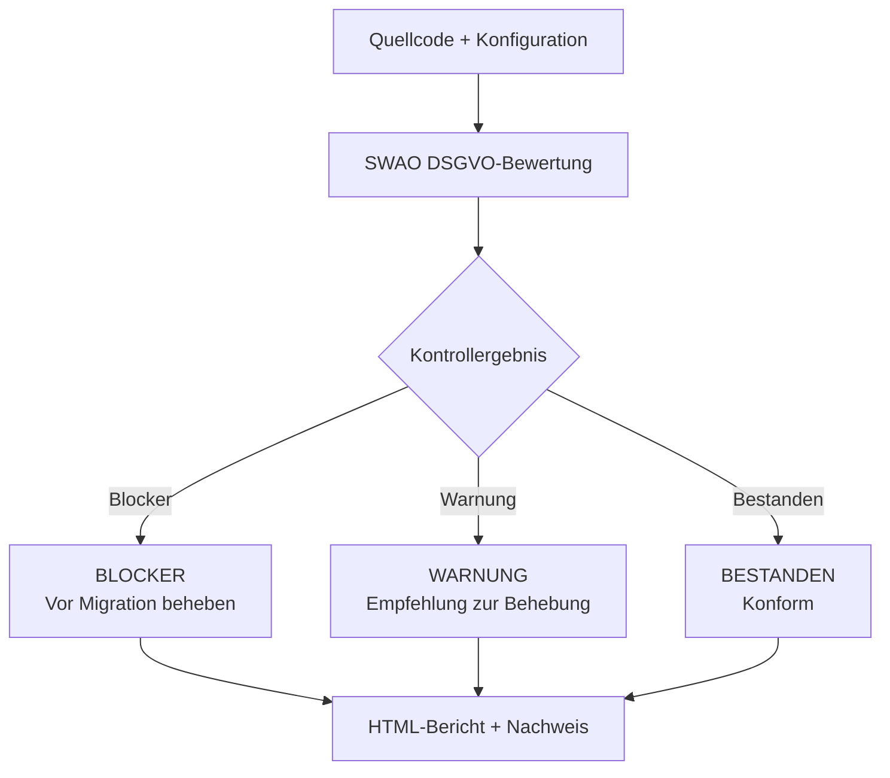

<!-- +------------------------------------------------------------------+
     | SWAO -- Community Edition                                        |
     +------------------------------------------------------------------+ -->

# DSGVO (GDPR)

## Was ist die DSGVO?

Die Datenschutz-Grundverordnung (DSGVO, englisch: GDPR -- General Data Protection Regulation)
ist eine Verordnung der Europaeischen Union (EU 2016/679), die die Erhebung, Verarbeitung und
Speicherung personenbezogener Daten von Personen im Europaeischen Wirtschaftsraum regelt. Sie
trat am 25. Mai 2018 in Kraft und gilt fuer alle Organisationen, die personenbezogene Daten
von EU-Buergerinnen und -Buergern verarbeiten -- unabhaengig vom Standort der Organisation.

Bei Nichtbeachtung drohen Bussgelder von bis zu 20 Millionen Euro oder 4 % des weltweiten
Jahresumsatzes, je nachdem, welcher Betrag hoeher ist.

## Bedeutung fuer Cloud-Migrationen

Die Migration von Workloads in die Cloud bringt neue Risiken im Rahmen der DSGVO mit sich:

- **Datenspeicherort** -- personenbezogene Daten koennen in Laender uebertragen oder dort
  gespeichert werden, die keinen angemessenen Datenschutz im Sinne des EU-Rechts bieten.
- **Auftragsverarbeiterketten** -- Cloud-Anbieter beauftragen Unterauftragsverarbeiter,
  die ihrerseits die DSGVO-Anforderungen erfuellen muessen.
- **Betroffenenrechte** -- Cloud-gehostete Systeme muessen weiterhin Loeschung, Datenportabilitaet
  und Auskunftsersuchen innerhalb der gesetzlichen Fristen unterstuetzen.
- **Meldepflicht bei Datenpannen** -- Incident-Response-Verfahren muessen die 72-Stunden-Frist
  zur Meldung an die Aufsichtsbehoerde beruecksichtigen.

## Was SWAO prueft

Das DSGVO-Framework in SWAO deckt folgende Kontrolldomaenen ab:

| Domane | Beispiele gepruefter Kontrollen |
|--------|--------------------------------|
| Datenspeicherort | Speicherregion-Konfiguration, Datenuebertragungsmechanismen (Standardvertragsklauseln, Adaequanzbeschluesse) |
| Aufbewahrung | Aufbewahrungsrichtlinien, automatisierte Loeschpipelines, Backup-Umfang |
| Einwilligung | Einwilligungserfassungsmechanismen, Widerrufsflows, Marketing-Sperrlisten |
| Verschluesselung | Verschluesselung im Ruhezustand (AES-256 oder gleichwertig), Verschluesselung bei der Uebertragung (TLS 1.2+), Schluesselverwaltung |
| Zugangskontrolle | Rollenbasierter Zugang, Least-Privilege-Richtlinien, Regelmaessigkeit der Privilegienzugangspruefung |
| Reaktion bei Datenpannen | Erkennungstools fuer Vorfaelle, Benachrichtigungs-Runbooks, DSB-Registrierungsstatus |

### Kontrollauswertungsfluss



## Beispielbefund

```
Kontrolle: Art. 32 -- Sicherheit der Verarbeitung
Schwere:   Hoch
Befund:    S3-Bucket "user-uploads-prod" hat serverseitige Verschluesselung deaktiviert.
Evidenz:   terraform/modules/storage/main.tf Zeile 14: server_side_encryption_configuration nicht gesetzt
Hinweis:   SSE-S3 oder SSE-KMS aktivieren. Referenz: https://docs.aws.amazon.com/AmazonS3/latest/userguide/serv-side-encryption.html
```

## Weiterfuehrende Informationen

- [DSGVO-Volltext (EUR-Lex)](https://eur-lex.europa.eu/legal-content/DE/TXT/?uri=CELEX:32016R0679)
- [Leitlinien des Europaeischen Datenschutzausschusses](https://edpb.europa.eu/our-work-tools/general-guidance/guidelines-recommendations-best-practices_en)
