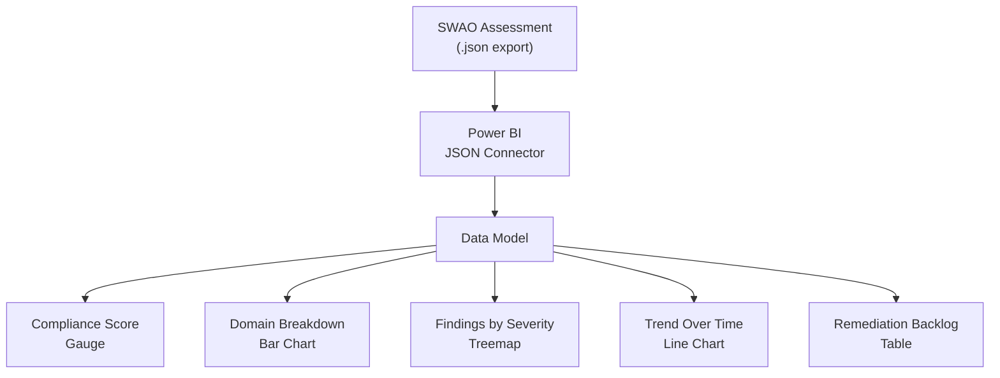

<!-- +------------------------------------------------------------------+
     | SWAO -- Community Edition                                        |
     +------------------------------------------------------------------+ -->

# Power BI Export

SWAO can export assessment results in a format compatible with Microsoft Power BI Desktop,
enabling rich dashboards, cross-assessment trend analysis, and integration with existing
enterprise reporting infrastructure.

## Exporting Data

Run the assessment and export:

```bash
swao assess --app <name> --export powerbi
```

Or export from the most recent assessment result:

```bash
swao report --format powerbi --output ./reports/gdpr-q2-2026.json
```

The export produces a JSON file structured for direct import into Power BI via the
**JSON connector** or the **SWAO Power BI template** (`.pbit`).

## Using the Power BI Template

The SWAO community provides a pre-built `.pbit` template with dashboards for:

- Compliance score over time (requires multiple assessment exports)
- Control domain breakdown
- Finding severity distribution
- Remediation progress tracking

To use the template:

1. Download `swao-dashboard.pbit` from the
   [SWAO GitHub Releases page](https://github.com/Accenture/SWAO/releases).
2. Open Power BI Desktop and select **File > Import > Power BI template**.
3. When prompted for the data source, point it at the exported JSON file.
4. Refresh the data model to populate the visuals.

## Export Schema

The JSON export follows this structure:

```json
{
  "swaoVersion": "0.3.9",
  "exportedAt": "2026-06-25T14:30:00Z",
  "app": "payment-service",
  "framework": "gdpr",
  "summary": {
    "total": 24,
    "pass": 15,
    "fail": 6,
    "warn": 3,
    "complianceScore": 0.71
  },
  "findings": [
    {
      "controlId": "ART-5",
      "controlName": "Data minimisation",
      "domain": "Data Protection",
      "status": "FAIL",
      "severity": "HIGH",
      "evidence": "src/user/profile.ts:42",
      "recommendation": "Remove non-essential personal data fields..."
    }
  ]
}
```

## Dashboard Visuals



## Multi-Assessment Trends

To track compliance progress over time, export after each sprint or audit cycle and
load all JSON files into a single Power BI report. The template's **Date dimension**
uses the `exportedAt` field to create trend lines automatically.

Recommended naming convention for exports:

```
reports/
  gdpr-2026-Q1.json
  gdpr-2026-Q2.json
  gdpr-2026-Q3.json
```

## Connecting to Power BI Service

To publish dashboards to Power BI Service (cloud):

1. Build and publish the `.pbix` file from Power BI Desktop.
2. Schedule a **Dataflow** refresh using the exported JSON files stored in SharePoint
   or OneDrive for Business.
3. Share the workspace with your compliance and audit team.

For automated pipeline integration, use the `--export powerbi` flag in your CI workflow
and commit the JSON to a dedicated `reports/` branch or upload to a shared drive.
