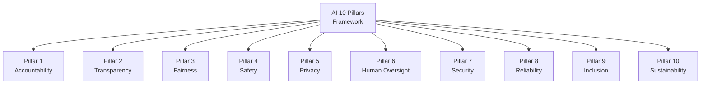

<!-- +------------------------------------------------------------------+
     | SWAO -- Community Edition                                        |
     +------------------------------------------------------------------+ -->

# AI 10 Pillars

The AI 10 Pillars framework maps Accenture's responsible AI principles to assessable controls,
enabling organisations to evaluate AI-integrated workloads against a structured governance model.

## Overview



## Framework ID

```
ai_10_pillars
```

Use this ID in `.swao.yml` or as the `--framework` flag:

```bash
swao assess --app <name> --framework ai_10_pillars
```

## Pillars

| ID | Pillar | Controls | Description |
|----|--------|---------|-------------|
| P1 | Accountability | 3 | Clear ownership of AI decisions and outcomes |
| P2 | Transparency | 4 | Explainable AI behaviour and decision audit trails |
| P3 | Fairness | 3 | Bias detection and equitable treatment of all groups |
| P4 | Safety | 4 | Prevention of harm from AI outputs and actions |
| P5 | Privacy | 3 | Data minimisation and consent in AI data pipelines |
| P6 | Human Oversight | 3 | Human-in-the-loop controls for high-stakes decisions |
| P7 | Security | 3 | Adversarial robustness and model integrity |
| P8 | Reliability | 3 | Consistent, predictable AI performance |
| P9 | Inclusion | 2 | Accessible design and equitable access |
| P10 | Sustainability | 2 | Environmental impact of AI infrastructure |

## Key Controls

### P1-C1 -- AI Accountability Owner

Every AI-integrated system must designate a named accountability owner responsible for
the AI system's decisions and outcomes. Evidence: organisational chart or RACI entry.

### P2-C1 -- Decision Explainability

Model outputs affecting users must be accompanied by a human-readable explanation or
reasoning trace. Evidence: API response schema or UI screenshot.

### P3-C1 -- Bias Evaluation

Training and production data must be evaluated for demographic bias before deployment.
Evidence: bias audit report or test suite output.

### P4-C1 -- Harm Guardrails

AI systems must implement output filtering or refusal mechanisms for harmful content.
Evidence: system prompt, filter configuration, or test results.

## Running an Assessment

```bash
swao assess --app my-ai-app --framework ai_10_pillars
```

SWAO analyses the source path for AI integration patterns (API calls to LLM providers,
model-loading code, inference endpoints) and maps findings to the 10 pillars.
