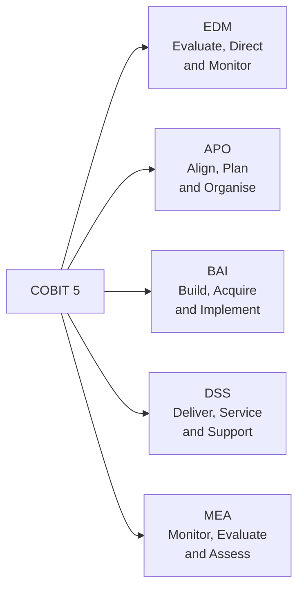

<!-- +------------------------------------------------------------------+
     | SWAO -- Community Edition                                        |
     +------------------------------------------------------------------+ -->

# COBIT 5

COBIT 5 (Control Objectives for Information and Related Technologies) is an IT governance
framework from ISACA that helps organisations manage and govern enterprise IT. SWAO maps
COBIT 5 process goals to assessable controls for cloud workloads.

## Framework ID

```
cobit_5
```

```bash
swao assess --app <name> --framework cobit_5
```

## Domain Structure



## Assessed Domains

| Domain | Code | Controls Assessed | Focus |
|--------|------|------------------|-------|
| Evaluate, Direct and Monitor | EDM | 6 | Governance framework, risk, resource management |
| Align, Plan and Organise | APO | 9 | Strategy, architecture, risk management |
| Build, Acquire and Implement | BAI | 8 | Change management, solution delivery |
| Deliver, Service and Support | DSS | 8 | Operations, incident management, business continuity |
| Monitor, Evaluate and Assess | MEA | 6 | Performance monitoring, compliance assurance |

## Key Controls

### EDM03 -- Risk Optimisation

Evaluate risk appetite, direct risk management practices, and monitor risk
exposure against defined tolerances. SWAO checks for documented risk assessments and
approved thresholds in infrastructure-as-code configurations.

### APO13 -- Security Management

Establish and maintain an information security management system aligned with business
requirements. SWAO checks for security policies, encryption configurations, and access
control definitions.

### DSS05 -- Security Services

Protect enterprise information against malware, and manage network and connectivity
security. SWAO checks for firewall rules, patch management evidence, and endpoint controls.

### MEA02 -- Internal Control System

Monitor and evaluate the adequacy and effectiveness of the internal control system.
SWAO checks for audit logging, access review records, and control testing evidence.

## Running an Assessment

```bash
swao assess --app my-app --framework cobit_5
```
