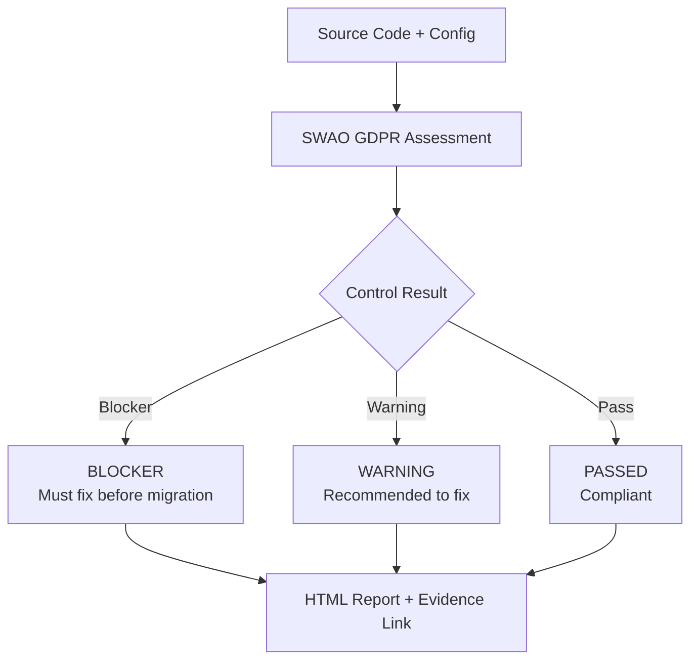

<!-- +------------------------------------------------------------------+
     | SWAO -- Community Edition                                        |
     +------------------------------------------------------------------+ -->


# GDPR

## What is GDPR?

The General Data Protection Regulation (GDPR) is a European Union regulation (EU 2016/679)
that governs the collection, processing, and storage of personal data relating to individuals
in the European Economic Area. It came into force on 25 May 2018 and applies to any
organisation that processes the personal data of EU residents, regardless of where that
organisation is based.

Non-compliance carries administrative fines of up to EUR 20 million or 4% of global annual
turnover, whichever is higher.

## Why it Matters for Cloud Migration

Migrating workloads to the cloud introduces new risks under GDPR:

- **Data residency** -- personal data may travel to or be stored in countries without
  adequate protection status under EU law.
- **Sub-processor chains** -- cloud providers engage sub-processors that must themselves
  comply with GDPR obligations.
- **Data subject rights** -- cloud-hosted systems must still support erasure, portability,
  and access requests within the statutory time limits.
- **Breach notification** -- incident response procedures must account for the 72-hour
  supervisory authority notification window.

## What SWAO Checks

The GDPR framework in SWAO covers the following control domains:

| Domain | Examples of Controls Assessed |
|--------|-------------------------------|
| Data residency | Storage region configuration, data transfer mechanisms (SCCs, adequacy decisions) |
| Retention | Retention policy definitions, automated deletion pipelines, backup scope |
| Consent | Consent capture mechanisms, withdrawal flows, marketing suppression lists |
| Encryption | Encryption at rest (AES-256 or equivalent), encryption in transit (TLS 1.2+), key management |
| Access control | Role-based access, least-privilege policies, privileged access review cadence |
| Breach response | Incident detection tooling, notification runbooks, DPA registration status |

### Control evaluation flow



## Example Finding

```
Control:   Art. 32 -- Security of processing
Severity:  High
Finding:   S3 bucket "user-uploads-prod" has server-side encryption disabled.
Evidence:  terraform/modules/storage/main.tf line 14: server_side_encryption_configuration not set
Guidance:  Enable SSE-S3 or SSE-KMS. Reference: https://docs.aws.amazon.com/AmazonS3/latest/userguide/serv-side-encryption.html
```

## Further Reading

- [EU GDPR full text (EUR-Lex)](https://eur-lex.europa.eu/legal-content/EN/TXT/?uri=CELEX:32016R0679)
- [European Data Protection Board guidelines](https://edpb.europa.eu/our-work-tools/general-guidance/guidelines-recommendations-best-practices_en)
