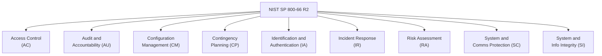

<!-- +------------------------------------------------------------------+
     | SWAO -- Community Edition                                        |
     +------------------------------------------------------------------+ -->

# NIST SP 800-66 Revision 2

NIST Special Publication 800-66 Revision 2 provides guidance on implementing the HIPAA
Security Rule. Where the [HIPAA](/en/frameworks/hipaa) framework assesses the regulation
itself, NIST SP 800-66 R2 assesses the implementation guidance -- providing a more
prescriptive technical control set suitable for healthcare organisations seeking NIST
alignment.

## Framework ID

```
nist_sp_800_66r2
```

```bash
swao assess --app <name> --framework nist_sp_800_66r2
```

## Control Families



## Control Family Reference

| Family | Code | Controls | Description |
|--------|------|---------|-------------|
| Access Control | AC | 9 | Least privilege, session management, remote access |
| Audit and Accountability | AU | 7 | Audit logging, log review, retention |
| Configuration Management | CM | 6 | Baselines, change control, software inventory |
| Contingency Planning | CP | 5 | Backup, disaster recovery, testing |
| Identification and Authentication | IA | 8 | MFA, password policy, service accounts |
| Incident Response | IR | 6 | Response plan, detection, containment, recovery |
| Risk Assessment | RA | 5 | Risk analysis, vulnerability scanning |
| System and Communications Protection | SC | 11 | Encryption in transit, network segmentation |
| System and Information Integrity | SI | 9 | Malware protection, patch management, alerting |

## Relationship to HIPAA

NIST SP 800-66 R2 does not replace HIPAA -- it implements it. Running both frameworks
gives a complete picture:

- **HIPAA framework**: are the regulatory requirements met?
- **NIST SP 800-66 R2 framework**: are the NIST-recommended implementation practices followed?

Running both in sequence:

```bash
swao assess --app my-app --framework hipaa
swao assess --app my-app --framework nist_sp_800_66r2
```

## Key Controls

### AC-2 -- Account Management

All user accounts must be formally managed with documented provisioning, review, and
revocation processes. SWAO checks IAM configurations and access review artefacts.

### AU-2 -- Event Logging

Define which events must be logged (authentication, access to ePHI, admin actions).
SWAO checks logging configurations against the required event categories.

### SC-28 -- Protection of Information at Rest

ePHI stored on any medium must be encrypted. SWAO checks storage configurations,
database settings, and infrastructure-as-code for encryption-at-rest controls.

### SI-2 -- Flaw Remediation

Software flaws must be identified, reported, and corrected. SWAO checks patch management
policies and dependency vulnerability scan configurations.
