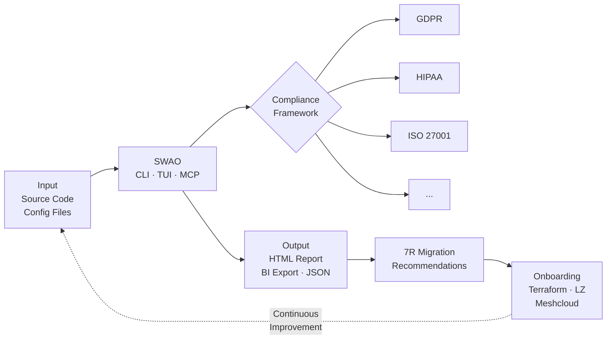
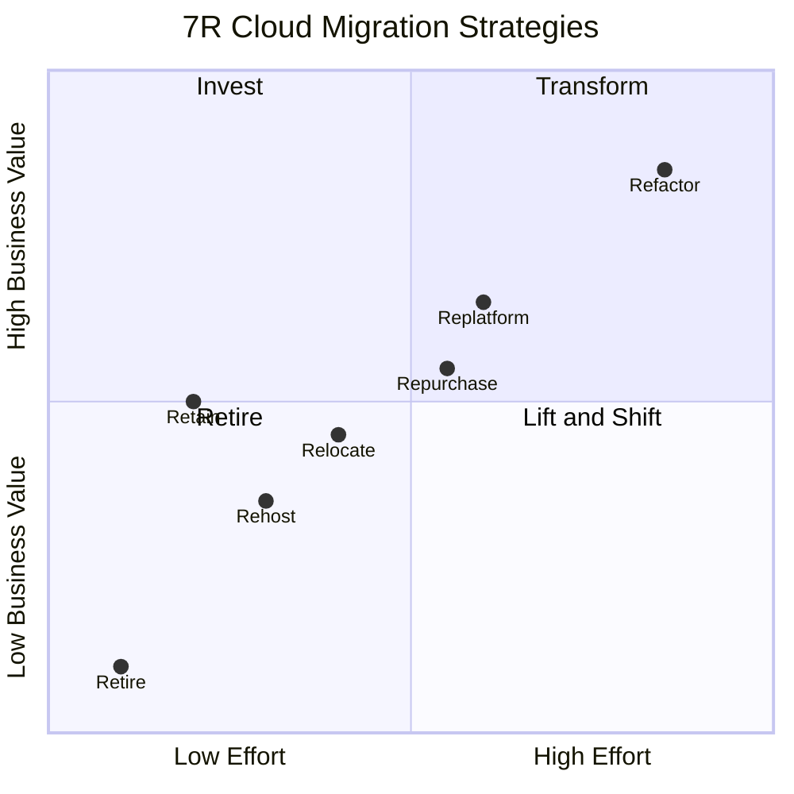

<!-- +------------------------------------------------------------------+
     | SWAO -- Community Edition                                        |
     +------------------------------------------------------------------+ -->

# Getting Started

This guide walks you through setting up SWAO and running your first workload assessment.

> **New to SWAO?** Visit the [SWAO product page](https://steady-echo-yp4z.here.now) for a
> business-focused overview, feature comparison by edition, and stakeholder benefit summaries.

## SWAO Architecture


## SWAO Workflow



## Prerequisites

Before you begin, ensure you have the following installed:

- **Node.js 20 or later** -- download from [nodejs.org](https://nodejs.org/)
- **pnpm** -- install with `npm install -g pnpm`
- **An LLM API key** -- SWAO uses an LLM provider for AI-assisted analysis. Supported providers include OpenAI, Azure OpenAI, Ollama (local), and Anthropic.
- **Playwright** (optional) -- required for the web-crawler ingestion path. Install with `npx playwright install`.

## Installation

Binary downloads for SWAO Community Edition are coming in Phase 2 of the release programme.
Check the [GitHub Releases page](https://github.com/Accenture/SWAO/releases) for the latest
availability updates.

In the meantime, you can run SWAO directly from source:

```bash
git clone https://github.com/Accenture/SWAO.git
cd SWAO
pnpm install
pnpm build
```

## Workspace Initialisation

Before running your first assessment, initialise a SWAO workspace in your project directory.
This is a one-time setup step that creates the configuration file and wires up your LLM
provider.

```bash
cd my-project
swao init
```

The `swao init` wizard prompts you for:

1. **App name** -- a short identifier for this application (used in reports and the TUI header)
2. **Compliance framework** -- the framework to assess against (e.g. `gdpr`, `hipaa`, `iso27001`)
3. **Source path** -- path to the application source code relative to the workspace root
4. **LLM provider** -- choose from `openai`, `azure-openai`, `anthropic`, `ollama`
5. **LLM API key** -- pasted interactively and stored in a local `.env` file (never committed)
6. **Playwright** -- whether to enable the web-crawler ingestion path

On completion, `swao init` creates:

- `.swao.yml` -- workspace configuration
- `.env` -- LLM credentials (add to `.gitignore` before committing)
- `.gitignore` entry for `.env` and `swao-output/`

### Example `.swao.yml` after init

```yaml
app: payment-service
framework: gdpr
sourcePath: ./src
outputPath: ./swao-output

llm:
  provider: anthropic
  model: claude-sonnet-4-6

playwright:
  enabled: false
```

## Quick Start

Follow these five steps to complete your first assessment:

**Step 1 -- Initialise your workspace**

Run the init wizard to create your workspace configuration and connect your LLM provider:

```bash
mkdir my-assessment && cd my-assessment
swao init
```

Follow the interactive prompts. See [Workspace Initialisation](#workspace-initialisation) above
for a full walkthrough of each prompt.

**Step 2 -- Verify your environment**

Run the diagnostics command to confirm that SWAO can reach all required dependencies:

```bash
swao doctor
```

Fix any issues flagged before proceeding.

**Step 3 -- Run an assessment**

Execute a compliance assessment against your configured application:

```bash
swao assess --app <name>
```

Replace `<name>` with the application identifier defined in your `.swao.yml`. SWAO will
analyse the source path and emit findings for each applicable control.

**Step 4 -- Open the HTML report**

After the assessment completes, open the generated HTML report in your browser:

```bash
swao report --open
```

The report contains every finding, its evidence link, and a summary by control domain.

**Step 5 -- Explore the interactive TUI**

For a live, navigable view of findings without leaving the terminal, run the assessment
in interactive mode:

```bash
swao assess --interactive
```

Use the arrow keys to navigate findings and press `q` to quit.

## Next Steps

- [CLI Reference](/en/reference/cli) -- full command and flag documentation
- [TUI](/en/reference/tui) -- explore findings interactively without leaving the terminal
- [MCP Server](/en/reference/mcp) -- connect SWAO to Claude Code or any MCP-compatible AI client
- [HTML Report](/en/exports/html-report) -- understand the audit-ready HTML output
- [Power BI Export](/en/exports/powerbi) -- build compliance dashboards in Power BI
- [Configuration](/en/reference/configuration) -- all `.swao.yml` options explained
- [Frameworks](/en/frameworks/gdpr) -- supported compliance frameworks

## Migration pathways (7R)


