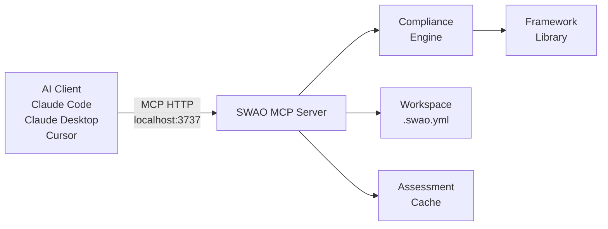

<!-- +------------------------------------------------------------------+
     | SWAO -- Community Edition                                        |
     +------------------------------------------------------------------+ -->


# MCP Server

SWAO exposes a [Model Context Protocol (MCP)](https://modelcontextprotocol.io/) server,
allowing any MCP-compatible AI client -- such as Claude Code, Claude Desktop, or Cursor --
to query SWAO's compliance engine directly from within a coding session.

## Starting the Server

```bash
swao mcp --http
```

By default the server listens on `http://localhost:3737`. Override the port with `--port`:

```bash
swao mcp --http --port 4000
```

The server runs until stopped with `Ctrl+C`. Keep it running in a separate terminal tab
while working in your AI client.

## Connecting Claude Code

Add the following to your Claude Code settings (`~/.claude/settings.json`):

```json
{
  "mcpServers": {
    "swao": {
      "type": "http",
      "url": "http://localhost:3737"
    }
  }
}
```

Restart Claude Code after saving. When SWAO MCP is active, you will see it listed under
available tools.

## Architecture



## Available Tools

The SWAO MCP server exposes the following tools to connected clients:

### `swao_assess`

Run a compliance assessment for a configured application.

**Parameters:**

| Parameter | Type | Required | Description |
|-----------|------|----------|-------------|
| `app` | string | Yes | Application identifier from `.swao.yml` |
| `framework` | string | No | Override the configured framework |

**Returns:** Assessment summary with finding counts by status and severity.

---

### `swao_findings`

Retrieve the detailed findings list from the most recent assessment.

**Parameters:**

| Parameter | Type | Required | Description |
|-----------|------|----------|-------------|
| `app` | string | Yes | Application identifier |
| `status` | string | No | Filter by status: `FAIL`, `WARN`, `PASS` |
| `severity` | string | No | Filter by severity: `CRITICAL`, `HIGH`, `MEDIUM`, `LOW` |

**Returns:** Array of finding objects with control ID, status, severity, and evidence.

---

### `swao_framework_list`

List all compliance frameworks available in the current installation.

**Returns:** Array of framework objects with ID, name, and control count.

---

### `swao_doctor`

Run the SWAO environment diagnostics.

**Returns:** List of environment checks with pass/fail status.

---

### `swao_report`

Generate or retrieve the HTML report for the most recent assessment.

**Parameters:**

| Parameter | Type | Required | Description |
|-----------|------|----------|-------------|
| `app` | string | Yes | Application identifier |

**Returns:** Path to the generated HTML file.

## Example Prompts

Once connected, you can ask your AI client:

- "Run a GDPR assessment on the payment-service app and summarise the critical findings."
- "Which GDPR controls are failing and what evidence was found?"
- "Generate an HTML report for the current assessment and tell me where it was saved."
- "List the compliance frameworks available in SWAO."

## Security Notes

- The MCP server listens on `localhost` only by default. Do not expose it to external networks.
- The server does not require authentication when running locally. Treat the port as a trusted
  local endpoint.
- Assessment output may contain source code excerpts. Ensure your AI client's data handling
  meets your organisation's requirements before using findings as prompt context.
